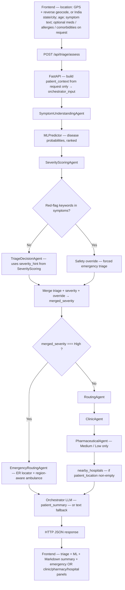

# Agent-Clinic: End-to-End Triage Flow

This document describes how a patient assessment travels from the browser through the API, the multi-agent orchestrator, and back to the UI.

---

## End-to-end flow (single diagram)

The chart below is the **full** path: browser input → `POST /api/triage/assess` → sequential agents → safety branch → severity branch → synthesis → JSON → UI. There is **no** persisted patient record: optional meds / allergies / comorbidities on the request are passed through only for ML and pharmacy safety.

---

## 1. Frontend

| Step | Behavior |
|------|----------|
| Location | On load, the app requests **browser geolocation** and calls a **reverse geocode** service to build a single `patient_location` string (city, region, country). If the user skips or geolocation fails, they select **India state + city** from dropdowns; that pair is combined with `India` for the API string when auto-location is not used. |
| Inputs | **Patient age** and **symptoms** (free text) are required for submit. Optional fields on the API schema (`current_medications`, `allergies`, `comorbidities`) are passed through for ML validation and pharmacy safety only; nothing is stored as a medical record. |
| Request | `POST /api/triage/assess` with JSON body matching `SymptomInput` (see `backend/src/models/schemas.py`). In development, the Vite dev server typically proxies `/api` to the FastAPI backend. |
| Response handling | The UI maps `triage_decision.severity_level`, `disease_probabilities`, `patient_summary` (Markdown), `emergency_routing`, `clinic_guidance`, `pharmaceutical_recommendations`, and related fields into emergency vs non-emergency panels. |

---

## 2. API entrypoint

**Route:** `POST /api/triage/assess`  
**Handler:** `backend/src/routes/triage.py` → `assess_symptoms`

1. Build **`patient_context`** from this request only (medications, allergies, comorbidities as `known_conditions`; no test reports or notes unless you extend the schema).
2. Build **`orchestrator_input`** (symptoms, age, location, mobility, lists above).
3. Return `orchestrator.process(orchestrator_input)` as JSON, or `400` with `detail` on error.

The triage router exposes **`POST /assess`** only (no separate context-store endpoints).

---

## 3. Orchestrator pipeline

**Class:** `OrchestratorAgent` in `backend/src/agents/orchestrator_agent.py`  
**Method:** `process(input_data)`

Agents and services run in this **fixed order**:

| # | Component | Role |
|---|-----------|------|
| 1 | **SymptomUnderstandingAgent** | Interprets raw symptom text into structured fields for downstream use. |
| 2 | **MLPredictor** | Predicts disease probabilities from symptom understanding; validates/ranks using request-derived `patient_context` (e.g. known conditions). |
| 3 | **SeverityScoringAgent** | Produces severity score/level using symptoms, ML output, and age (no separate history agent). |
| 4 | **Safety override** | If symptom text matches configured **red-flag keywords**, triage is forced toward emergency (see `RED_FLAG_KEYWORDS` in the orchestrator). |
| 5 | **TriageDecisionAgent** | If no override: LLM triage using disease probabilities, symptoms, age, comorbidities, test/condition lists from context, and **`severity_hint`** from step 3. |
| 6 | **Severity merge** | Final `severity_level` is the **most urgent** among triage agent, severity agent, and override. |

---

## 4. Branch: emergency vs non-emergency

Decision uses **merged `severity_level` == `"High"`** vs not.

### 4a. High severity (emergency)

- **EmergencyRoutingAgent** — ER locator and region-aware ambulance / emergency dispatch guidance using `patient_location`.
- **Routing guidance** — Emergency pathway messaging (pre-arrival instructions, etc.).
- **Pharmaceutical** — No normal OTC path; warnings emphasize emergency evaluation first.

### 4b. Non–High severity

- **RoutingAgent** — Care pathway guidance (e.g. urgent care vs self-care framing).
- **ClinicAgent** — Clinic-oriented guidance for the condition and location.
- **PharmaceuticalAgent** — Invoked for **Medium** and **Low** severity to produce OTC / safety-oriented recommendations when available.
- **Nearby hospitals** — If `patient_location` is non-empty, `EmergencyRoutingAgent.nearby_hospitals(...)` may attach facility hints into **`clinic_guidance.nearby_hospitals`**.

---

## 5. Patient-facing synthesis

The orchestrator calls its LLM (`get_response`) with a prompt that includes triage, routing, clinic, pharmacy, and hospital hints to produce **`patient_summary`** (Markdown-friendly narrative). If the LLM call fails, a **fallback** string is built from triage and routing fields.

---

## 6. Typical response payload (top-level keys)

Returned dict from `OrchestratorAgent.process` includes (non-exhaustive):

| Key | Purpose |
|-----|---------|
| `agent_flow` | Compact trace of which agents contributed and key outputs. |
| `symptom_understanding` | Structured symptom interpretation. |
| `disease_probabilities` | List of `{ condition, probability }` for the UI / transparency. |
| `severity_scoring` | Severity agent output. |
| `triage_decision` | Final severity, primary condition, recommended action, reasoning, etc. |
| `emergency_routing` | Populated for **High** severity (ER locator, ambulance payload). |
| `routing_guidance` | Pathway and instructions (emergency or non-emergency). |
| `clinic_guidance` | Clinic pathway; may include `nearby_hospitals` for non-emergency. |
| `pharmaceutical_recommendations` | Pharmacy agent output when invoked. |
| `patient_summary` | Single narrative for the patient (rendered as Markdown on the frontend). |
| `next_steps` | Often mirrors pre-arrival / routing instructions. |
| `warnings` | Safety warnings from triage when present. |
| `decision_trace` | Flags such as safety override, pharma invoked, fallback used. |

---

## 7. Configuration and dependencies

- **LLM agents** require `OPENAI_API_KEY` (or equivalent configured in backend env).
- **Optional:** `GOOGLE_MAPS_API_KEY` for richer place-based routing when implemented in services that call Google APIs.
- **ML:** Default model path and training data are configured in `backend/config.py` (e.g. `ML_DATASET_PATH`, model cache path).

---

## 8. Related source files

| Area | Path |
|------|------|
| Assess route | `backend/src/routes/triage.py` |
| Orchestration | `backend/src/agents/orchestrator_agent.py` |
| Request schema | `backend/src/models/schemas.py` |
| ML | `backend/src/services/ml_predictor.py` |
| Frontend submit | `frontend/src/App.tsx` |
| Reverse geocode helper | `frontend/src/lib/reverseGeocode.ts` |

This flow is descriptive of the current codebase and is not a clinical protocol or substitute for professional medical advice.
